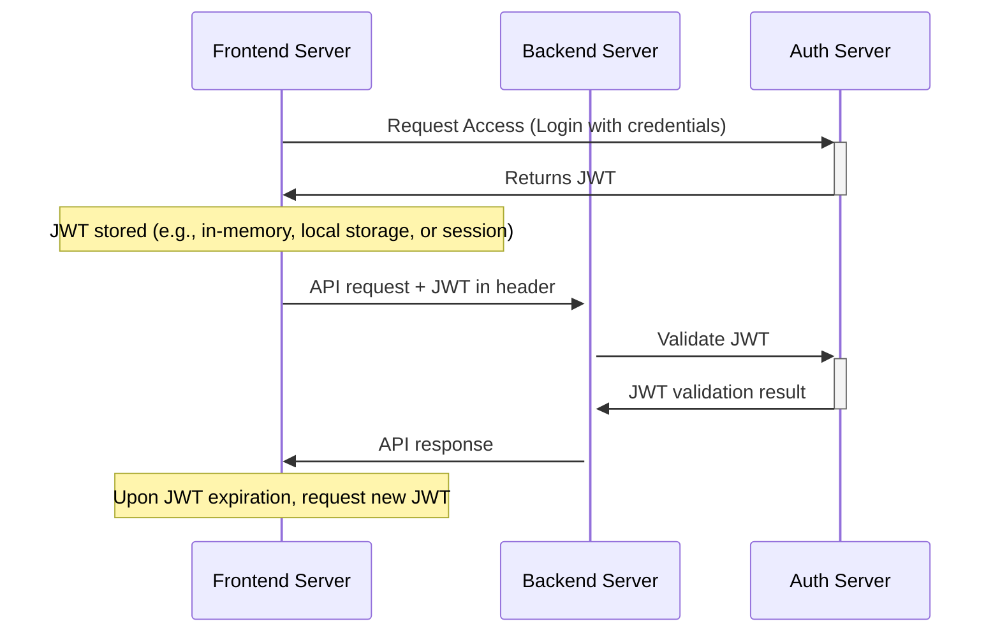
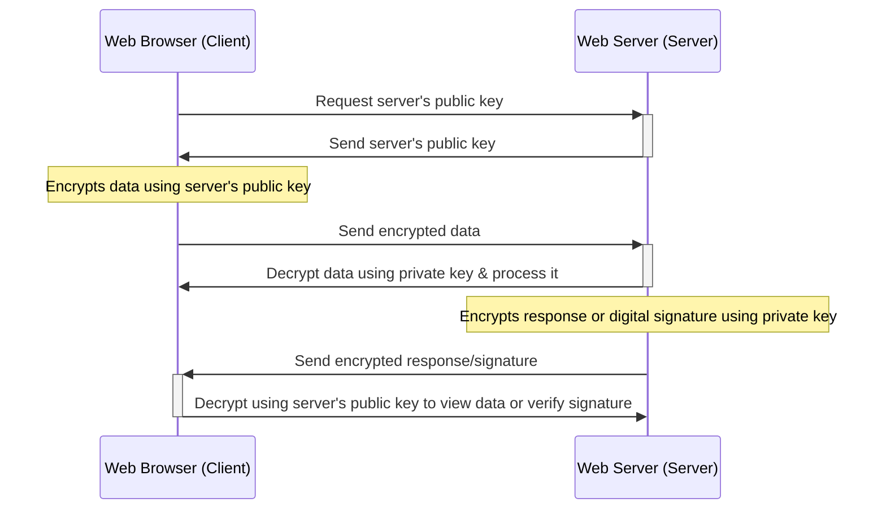

# edu-crypto

## Hashing ( with brute force attack )

> MD5 is a widely used cryptographic hash function that produces a 128-bit hash value.
> It is commonly used to check data integrity.
> HOWEVER, MD5 is NOT suitable for further security purposes as it is vulnerable to hash collisions.
> This means that different input values can produce the same hash output, which is a major vulnerability.
> const secretHash = crypto.createHash('md5').update(password).digest('hex');

> SHA-512 is a member of the SHA-2 cryptographic hash functions family.
> It produces a 512-bit hash value, which is typically rendered as a 128-character hex number.
> It's more secure than MD5 and is suitable for further security purposes.

```js
const crypto = require('crypto');
const bf = require('bruteforce');

const password = "abaa";
const secretHash = crypto.createHash('sha512').update(password).digest('hex');

const hack = (attemptedPassword) => {
  // Avoid MD5 for the same reasons mentioned above.
  // const hash = crypto.createHash('md5').update(attemptedPassword).digest('hex');
  // Use SHA-512 for better security.
  const hash = crypto.createHash('sha512').update(attemptedPassword).digest('hex');
  
  console.log(`Trying password: ${attemptedPassword}, Match: ${secretHash === hash}`);
  
  if (secretHash === hash) {
    console.log(`Password found: ${attemptedPassword}`);
    process.exit();  // Stop the process once password is found
  }
}

bf({
  len: password.length,
  chars: ['a', 'b'],
  step: hack
});
```


## JWT (signing and verifying)



```js
const crypto = require('crypto');
const jwt = require('jsonwebtoken');

// Generate a secure random key for signing the JWT.
// Using 256 bytes is a bit overkill for JWT signing purposes. Typically, a 256-bit (32 bytes) key is sufficient.
const key = crypto.randomBytes(32).toString('base64');

// JWT consists of three parts: Header, Payload, and Signature.
// Here, we're creating a token with a payload of { foo: 'bar' }.
// The token is signed using the generated key.
const token = jwt.sign({ foo: 'bar' }, key);

console.log(`Generated JWT: ${token}`);

try {
  // Verify the JWT. If the token was tampered with, jwt.verify will throw an error.
  // If the token is valid, it returns the decoded payload.
  const decoded = jwt.verify(token, key);
  
  console.log('Decoded JWT Payload:', decoded);
} catch (err) {
  console.error('Error verifying token:', err.message);
}
```

### Decoded JWT with iat (and exp when set)

```json
{
  "foo": "bar",
  "iat": 1683895327,
  "exp": 1683908927
}
```

## HTTPS



```js
const crypto = require('crypto');

// Generate an RSA key pair
const keyPair = crypto.generateKeyPairSync('rsa', {
    modulusLength: 520,
    publicKeyEncoding: {
        type: 'spki',
        format: 'pem'
    },
    privateKeyEncoding: {
        type: 'pkcs8',
        format: 'pem',
        cipher: 'aes-256-cbc',
        passphrase: 'secret'
    }
});

const plaintext = "hemligt hemligt";

// Encrypting with the public key and decrypting with the private key
// This is the common use case in SSL/TLS where the client encrypts data using the server's public key, 
// and only the server can decrypt it using its private key.
const encryptedWithPublic = crypto.publicEncrypt(keyPair.publicKey, Buffer.from(plaintext));
const decryptedWithPrivate = crypto.privateDecrypt({ key: keyPair.privateKey, passphrase: 'secret' }, encryptedWithPublic);
console.log(`Decrypted with Private: ${decryptedWithPrivate.toString()}`);

// Encrypting with the private key and decrypting with the public key
// This method is typically used for digital signatures rather than encryption in SSL/TLS. 
// Here, a piece of data encrypted with a private key can be decrypted by anyone with the public key, 
// proving it came from the holder of the private key.
const encryptedWithPrivate = crypto.privateEncrypt({ key: keyPair.privateKey, passphrase: 'secret' }, Buffer.from(plaintext));
const decryptedWithPublic = crypto.publicDecrypt(keyPair.publicKey, encryptedWithPrivate);
console.log(`Decrypted with Public: ${decryptedWithPublic.toString()}`);
```

  Cryptographic Acronyms and Terms

Cryptographic Acronyms and Terms
--------------------------------

### 1\. RSA

**RSA**: Stands for **Rivest–Shamir–Adleman**, named after its inventors.

*   It's one of the first public-key cryptosystems and is widely used for secure data transmission and encryption.
*   In RSA, the encryption key is public, while the decryption key is kept private.

### 2\. SPKI

**SPKI**: Stands for **Subject Public Key Info**.

*   A format used to represent a public key along with additional information about the key (like its algorithm).

### 3\. PEM

**PEM**: Stands for **Privacy-Enhanced Mail**.

*   A de facto file format for storing and sending cryptographic keys, certificates, and other data.
*   Characterized by its "BEGIN CERTIFICATE" and "END CERTIFICATE" delimiters.
*   Essentially, it's a base64 encoding of data with headers and footers.

### 4\. PKCS8

**PKCS8**: Stands for **Public-Key Cryptography Standards #8**.

*   Specifies a standard syntax for private key information, which includes any algorithm-specific fields.
*   Often used to store private keys in files securely.

### 5\. AES-256-CBC

**AES**: Stands for **Advanced Encryption Standard**—a symmetric encryption algorithm.

*   **256**: Refers to the key size, which is 256 bits in this case.
*   **CBC**: Stands for **Cipher Block Chaining**—a mode of operation for symmetric encryption. In CBC mode, each block of plaintext is XORed with the previous ciphertext block before being encrypted.

### 6\. Passphrase

**Passphrase**: Similar to a password but generally longer for added security.

*   Used to encrypt the private key so that even if the key file gets into the wrong hands, the key is protected by this passphrase.

_When generating cryptographic keys, understanding these terms is crucial for proper key management, storage, and usage. Misunderstanding or misconfiguring these settings can compromise the security of encrypted data or communications._
