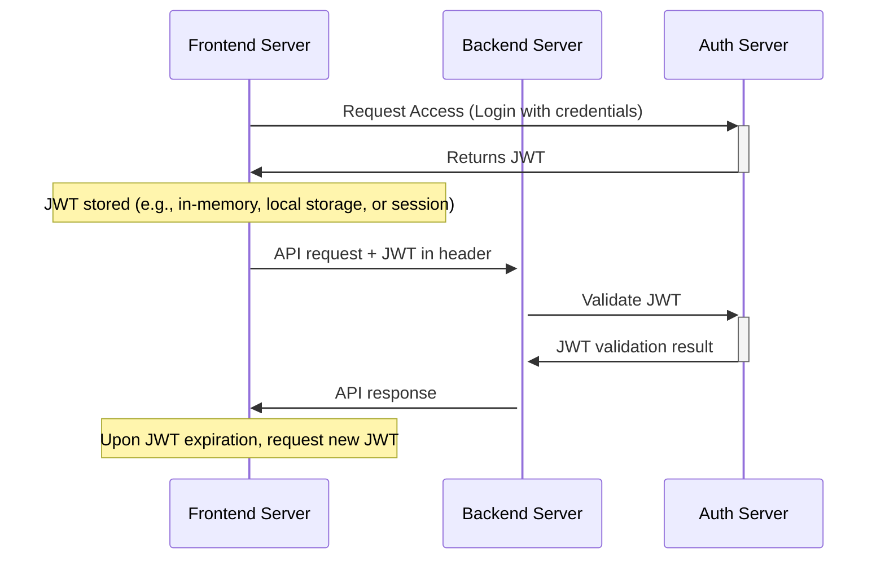

# edu-crypto

## JWT (signing and verifying)



```js
const crypto = require('crypto');
const jwt = require('jsonwebtoken');

// Generate a secure random key for signing the JWT.
// Using 256 bytes is a bit overkill for JWT signing purposes. Typically, a 256-bit (32 bytes) key is sufficient.
const key = crypto.randomBytes(32).toString('base64');

// JWT consists of three parts: Header, Payload, and Signature.
// Here, we're creating a token with a payload of { foo: 'bar' }.
// The token is signed using the generated key.
const token = jwt.sign({ foo: 'bar' }, key);

console.log(`Generated JWT: ${token}`);

try {
  // Verify the JWT. If the token was tampered with, jwt.verify will throw an error.
  // If the token is valid, it returns the decoded payload.
  const decoded = jwt.verify(token, key);
  
  console.log('Decoded JWT Payload:', decoded);
} catch (err) {
  console.error('Error verifying token:', err.message);
}
```

### Decoded JWT with iat (and exp when set)

```js
const payload = {
    "foo": "bar",
  "iat": 1683895327,
  "exp": 1683908927
};

// Convert the 'iat' value to a JavaScript Date object
const issuedAtDate = new Date(payload.iat * 1000);

// Convert the 'exp' value to a JavaScript Date object
const expirationDate = new Date(payload.exp * 1000);

// Log them out or use them as needed
console.log(`Token was issued at: ${issuedAtDate}`);
console.log(`Token will expire at: ${expirationDate}`);
```


  JWT Terms and Concepts

JWT Terms and Concepts
----------------------

### 1\. JWT

**JWT**: Stands for **JSON Web Token**.

*   A compact, URL-safe means of representing claims to be transferred between two parties.
*   Commonly used for authentication and information exchange in web services.
*   Consists of three parts: header, payload, and signature.

### 2\. Header

The **header** typically consists of two parts:

*   **alg**: The algorithm used to sign the token, e.g., HMAC SHA256 or RSA.
*   **typ**: The type of token, which is JWT.

### 3\. Payload

The **payload** contains claims, which are statements about an entity (typically, the user) and additional data.

*   There are three types of claims: registered, public, and private claims.
*   **Registered claims**: A set of predefined claims like "iss" (issuer), "exp" (expiration time), and "sub" (subject).
*   **Public claims**: Claims that can be defined at will by those using JWTs.
*   **Private claims**: Claims used to share information between parties that agree on them and are not registered or public.

### 4\. Signature

To create the **signature** for the JWT:

*   The base64Url encoded header and payload are combined with a secret using the algorithm specified in the header.
*   The resulting signature is used to verify that the sender of the JWT is who they say they are and to ensure the message wasn't changed along the way.

### 5\. JWS & JWE

**JWS** and **JWE** are two common specifications related to JWT.

*   **JWS (JSON Web Signature)**: Provides a mechanism to represent content secured with digital signatures or Message Authentication Codes (MACs) using JSON data structures.
*   **JWE (JSON Web Encryption)**: Provides a mechanism to represent encrypted content using JSON data structures.

_JWTs are a powerful tool in modern web development, especially for Single Sign-On (SSO) and stateless authentication scenarios. However, they should be used carefully and securely, ensuring that sensitive data isn't exposed and best practices are followed._
